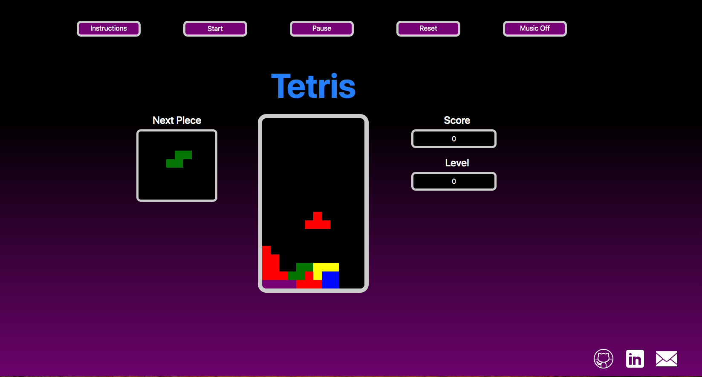

# Tetris

This is my version of the classic game Tetris.

##Background:

Tetris is classic tile matching puzzle game where you rotate falling blocks to clear the screen. The objective of the game is to manipulate these Tetriminos, by moving each one sideways and/or rotating by quarter-turns, so that they form a solid horizontal line without gaps. When such a line is formed, it disappears and any blocks above it fall down to fill the space. When a certain number of lines are cleared, the game enters a new level. As the game progresses, each level causes the Tetriminos to fall faster, and the game ends when the stack of Tetriminos reaches the top of the playing field and no new Tetriminos are able to enter.

##Technologies:

- JavaScript
- HTML
- CSS
- Bootstrap

##Functionality

- Start/pause/reset game
- Rotate falling blocks
- Optional background music
- Increase speed with level up.
- Score/Level tracker
- Preview upcoming game piece
